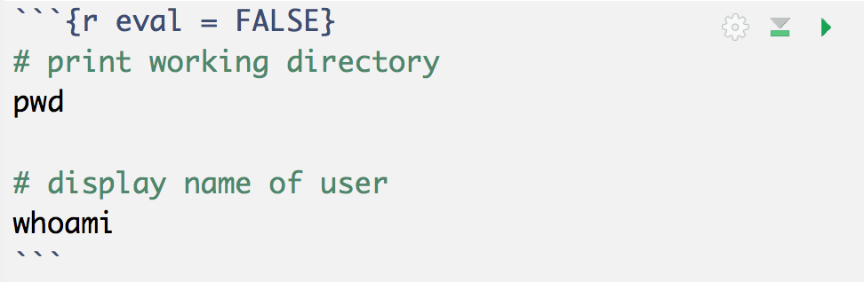

```{r setup, include=FALSE}
knitr::opts_chunk$set(echo = TRUE)
library(dplyr)
library(ggplot2)
```

> ### Learning Objectives:
>
> - Get started with `"dplyr"`
> - Get to know the basic dplyr verbs:
> - `slice()`, `filter()`, `select()`
> - `mutate()`
> - `arrange()`
> - `summarise()`
> - `group_by()`
> - Practicing with the command line
> - Navigating the filesystem and managing files


### General Instructions

- Write your descriptions, explanations, and code in an `Rmd` (R markdown) file.
- Name this file as `lab03-first-last.Rmd`, where `first` and `last` are your
first and last names (e.g. `lab03-gaston-sanchez.Rmd`).
- Knit your `Rmd` file as an html document (default option).
- Submit your `Rmd` and `html` files to bCourses, in the corresponding lab assignment.


------

## Manipulating Data Frames

So far you've been manipulating data tables 
(under the class of `"data.frame"` objects) using bracket notation, 
`dat[ , ]`, and the dollar operator, `dat$name`, in order to select specific 
rows, columns, or cells.

In the first part of this lab, you will start learning about another approach to manipulate tables. 
We are going to use the functionality of the 
package `"dplyr"` to work with tabular data in a more syntactic way. This is a 
fairly recent package introduced a couple of years ago, but it is based on more
than a decade of research and work lead by Hadley Wickham.

While you follow this lab, you may want to open this cheatsheet:

- [dplyr cheatsheet](https://github.com/ucb-stat133/stat133-fall-2019/blob/master/cheatsheets/dplyr-cheatsheet.pdf)


-----


### Installing `"dplyr"`

I'm assuming that you already installed the package `"dplyr"`. 
If that's not the case then __run on the console__ the command below 
(do NOT include this command in your `Rmd`):

```r
# don't include this command in your Rmd file
# don't worry too much if you get a warning message
install.packages(c("dplyr"))
```

Remember that you only need to install a package once! After a package has been 
installed in your machine, there is no need to call `install.packages()` again 
on the same package. What you should always invoke in order to use the 
functions in a package is the `library()` function:

```{r eval=FALSE}
# (include these commands in your Rmd file)
# don't forget to load the packages
library(dplyr)
```

__About loading packages:__ Another rule to keep in mind is to always load any 
required packages at the very top of your script files (`.R` or `.Rmd` or `.Rnw` files). 
Avoid calling the `library()` function in the middle of a script. Instead, 
load all the packages before anything else.


-----

## NBA Players Data

```{r nba, echo = FALSE}
dat <- read.csv('../data/nba2018-players.csv', stringsAsFactors = FALSE)
```

The data file for this lab is `nba2018-players.csv`, which located in the `data/` folder of the class' github repository.

To import the data in R you can use the following code:

```{r read, eval = FALSE}
# import data file
git <- "https://raw.githubusercontent.com/ucb-stat133/"
hub <- "stat133-fall-2019/master/data/nba2018-players.csv"
github <- paste0(git, hub)
dat <- read.csv(github, stringsAsFactors = FALSE)
```


-----

## Basic `"dplyr"` verbs

To make the learning process of `"dplyr"` gentler, Hadley Wickham proposes 
beginning with a set of five _basic verbs_ or operations for data frames 
(each verb corresponds to a function in `"dplyr"`):

- __filter__: keep rows matching criteria
- __select__: pick columns by name
- __mutate__: add new variables
- __arrange__: reorder rows
- __summarise__: reduce variables to values

These are the verbs or _actions_ you were introduced to in last week's lab. I've slightly modified Hadley's list of verbs: 

- `filter()`, `slice()`, and `select()`: subsetting and selecting rows and columns
- `mutate()`: add new variables
- `arrange()`: reorder rows
- `summarise()`: reduce variables to values
- `group_by()`: grouped (aggregate) operations

-----

## Filtering, slicing, and selecting

`slice()` allows you to select rows by position:

```{r}
# first three rows
three_rows <- slice(dat, 1:3)
three_rows
```

`filter()` allows you to select rows by condition:

```{r}
# subset rows given a condition
# (height greater than 85 inches)
gt_85 <- filter(dat, height > 85)
gt_85
```

`select()` allows you to select columns by name:

```{r}
# columns by name
player_height <- select(dat, player, height)
```


### Your turn*:

- use `slice()` to subset the data by selecting the first 5 rows.
- use `slice()` to subset the data by selecting rows 10, 15, 20, ..., 50.
- use `slice()` to subset the data by selecting the last 5 rows.
- use `filter()` to subset those players with height less than 70 inches tall.
- use `filter()` to subset rows of Golden State Warriors (`'GSW'`).
- use `filter()` to subset rows of GSW centers (`'C'`).
- use `filter()` and then `select()`, to subset rows of lakers (`'LAL'`), and 
then display their names.
- use `filter()` and then `select()`, to display the name and salary, 
of GSW point guards
- find how to select the name, age, and team, of players with more than 
10 years of experience, making 10 million dollars or less.
- find how to select the name, team, height, and weight, of rookie players, 
20 years old, displaying only the first five occurrences (i.e. rows)


-----

## Adding new variables: `mutate()`

Another basic verb is `mutate()` which allows you to add new variables.
Let's create a small data frame for the warriors with three columns: 
`player`, `height`, and `weight`:

```{r}
# creating a small data frame step by step
gsw <- filter(dat, team == 'GSW')
gsw <- select(gsw, player, height, weight)
gsw <- slice(gsw, c(4, 8, 10, 14, 15))
gsw
```

Now, let's use `mutate()` to (temporarily) add a column with the ratio 
`height / weight`:

```{r}
mutate(gsw, height / weight)
```

You can also give a new name, like: `ht_wt = height / weight`:

```{r}
mutate(gsw, ht_wt = height / weight)
```

In order to permanently change the data, you need to assign the changes to 
an object:

```{r}
gsw2 <- mutate(gsw, ht_m = height * 0.0254, wt_kg = weight * 0.4536)
gsw2
```


## Reordering rows: `arrange()`

The next basic verb of `"dplyr"` is `arrange()` which allows you to reorder 
rows. For example, here's how to arrange the rows of `gsw` by `height`

```{r}
# order rows by height (increasingly)
arrange(gsw, height)
```

By default `arrange()` sorts rows in increasing order. To arrange rows in 
descending order you need to use the auxiliary function `desc()`.

```{r}
# order rows by height (decreasingly)
arrange(gsw, desc(height))
```

```{r}
# order rows by height, and then weight
arrange(gsw, height, weight)
```

-----

### Your Turn*:

- using the data frame `gsw`, add a new variable `product` with the product of 
`height` and `weight`.

- create a new data frame `gsw3`, by adding columns `log_height` and `log_weight`
with the log transformations of `height` and `weight`.

- use the original data frame to `filter()` and `arrange()` those players with height less than 71 inches tall, in increasing order.

- display the name, team, and salary, of the top-5 highest paid players

- display the name, team, and salary, for the top-5 highest paid players

- display the name, team, and points3, of the top 10 three-point players

- create a data frame `gsw_mpg` of GSW players, that contains variables for 
player name, experience, and `min_per_game` (minutes per game), sorted by `min_per_game` (in descending order)


-----

## Summarizing values with `summarise()`

The next verb is `summarise()`. Conceptually, this involves applying a function
on one or more columns, in order to summarize values. This is probably easier 
to understand with one example.

Say you are interested in calculating the average salary of all NBA players.
To do this "a la dplyr" you use `summarise()`, or its synonym function 
`summarize()`:

```{r}
# average salary of NBA players
summarise(dat, avg_salary = mean(salary))
```

Calculating an average like this seems a bit _verbose_, especially
when you can directly use `mean()` like this:

```{r}
mean(dat$salary)
```

So let's make things a bit more interessting. What if you want to calculate some 
summary statistics for `salary`: min, median, mean, and max?

```{r}
# some stats for salary (dplyr)
summarise(
  dat, 
  min = min(salary),
  median = median(salary),
  avg = mean(salary),
  max = max(salary)
)
```

Well, this may still look like not much. You can do the same in base R 
(there are actually better ways to do this):

```{r}
# some stats for salary (base R)
c(min = min(dat$salary), 
  median = median(dat$salary),
  median = mean(dat$salary),
  max = max(dat$salary))
```


## Grouped operations

To actually appreciate the power of `summarise()`, we need to introduce the 
other major basic verb in `"dplyr"`: `group_by()`. This is the function that 
allows you to perform data aggregations, or _grouped operations_.

Let's see the combination of `summarise()` and `group_by()` to calculate the
average salary by team:

```{r}
# average salary, grouped by team
summarise(
  group_by(dat, team),
  avg_salary = mean(salary)
)
```

Here's a similar example with the average salary by position:

```{r}
# average salary, grouped by position
summarise(
  group_by(dat, position),
  avg_salary = mean(salary)
)
```

Here's a more fancy example: average weight and height, by position, displayed
in desceding order by average height:

```{r}
arrange(
  summarise(
    group_by(dat, position),
    avg_height = mean(height),
    avg_weight = mean(weight)),
  desc(avg_height)
)
```


### Your turn:

- use `summarise()` to get the largest height value.

- use `summarise()` to get the standard deviation of `points3`.

- use `summarise()` and `group_by()` to display the median of three-points,
by team.

- display the average triple points by team, in ascending order, of the 
bottom-5 teams (worst 3pointer teams)

- obtain the mean and standard deviation of `age`, for Power Forwards, with 5 
and 10 years of experience (including 5 and 10).


-----


## Basic Shell Commands

The second part of the lab involves navigating the file system and manipulating
files (and directories) with the following basic shell commands:

- `pwd`: print working directory
- `ls`: list files and directories
- `cd`: change directory (move to another directory)
- `mkdir`: create a new directory
- `touch`: create a new (empty) file
- `cp`: copy file(s)
- `mv`: rename file(s)
- `rm`: delete file(s)


This second part of the lab involves writing bash commands. Depending on your Operating System, you could include such commands inside code chunks in an `Rmd` file, that get evaluated when knitting into html. But we won't do that today (mainly because some of you use Windows computers).

Instead, write your bash commands inside a chunk that is NOT evaluated. One way to do this is to add the option `eval = FALSE` inside the curly braces of the chunk (see image below)




#### Cheatsheet and Online Man Pages

While you work on this part of the lab, you may want to open this cheatsheet:

- [command line cheatsheet](https://github.com/ucb-stat133/stat133-spring-2019/blob/master/cheatsheets/command-line-cheatsheet.pdf)

__Windows users:__ If you are using __git-bash__ (i.e. your OS is Windows) you don't have the `man` 
command to see the manual documentation of other commands. In this case you can 
check the _man_ pages online:

[http://man7.org/linux/man-pages/index.html](http://man7.org/linux/man-pages/index.html)


-----


### 1) Your Turn*: Lab Directory

- Open (or launch) the command line

- Use the command `pwd` to see what's your current directory

- Use `mkdir` to create a new directory `stat133-lab05`

- Change directory to `stat133-lab05`

- Use the command `curl` to download the following text file:
```bash
# the option is the letter O (Not the number 0)
curl -O http://textfiles.com/food/bread.txt
```

- Use the command `ls` to list the contents in your current directory

- Use the command `curl` to download these other text files:
	- http://textfiles.com/food/btaco.txt
	- http://textfiles.com/food/1st_aid.txt
	- http://textfiles.com/food/beesherb.txt
	- http://textfiles.com/food/bakebred.txt

- Use the command `curl` to download the following csv files:
	- http://archive.ics.uci.edu/ml/machine-learning-databases/forest-fires/forestfires.csv
	- http://web.pdx.edu/~gerbing/data/cars.csv
	- http://web.pdx.edu/~gerbing/data/color.csv
	- http://web.pdx.edu/~gerbing/data/snow.csv
	- http://web.pdx.edu/~gerbing/data/mid1.csv
	- http://web.pdx.edu/~gerbing/data/mid2.csv
	- http://web.pdx.edu/~gerbing/data/minutes1.csv
	- http://web.pdx.edu/~gerbing/data/minutes2.csv
	

### 2) Your Turn*: Inspecting a Directory

- Use the command `ls` to list the contents in your current directory

- Now try `ls -l` to list the contents in your current directory in long format

- Look at the `man` documentation of `ls` to find out how to list the contents in reverse order

- How would you list the contents in long format arranged by time?

- Find out how to use the wildcard `*` to list all the files with extension `.txt`

- Use the wildcard `*` to list all the files with extension `.csv` in reverse order

- You can use the character `?` to represent a single character: e.g. `ls mid?.csv`. Find out how to use the wilcard `?` to list `.csv` files with names made of 4 characters (e.g. `mid1.csv`, `snow.csv`)

- The command `ls *[1]*.csv` should list `.csv` files with names containing the number 1 (e.g. `mid1.csv`, `minutes1.csv`). Adapt the command to list `.csv` files with names containing the number 2.

- Find out how to list files with names containing any number.


### 3) Your Turn*: Moving Files

- Inside `stat133-lab05` create a directory `data`

- Change directory to `data`

- Create a directory `txt-files`

- Create a directory `csv-files`

- Use the command `mv` to move the `bread.txt` file to the folder `txt-files`. Without changing directories, use `ls` to confirm that
`bread.txt` is now inside `txt-files`.

- Use the wildcard `*` to move all the `.txt` files to the directory `txt-files`. Without changing directories, use `ls` to confirm that
all the `.txt` files are inside `txt-files`.

- Use the wildcard `*` to move all the `.csv` files to the directory `csv-files`. Without changing directories, use `ls` to confirm that
all the `.csv` files are inside `csv-files`.

- Try using the command `tree` to see a visual display of the filestructure. _Warning: You may not have this command in git-bash or in another shell flavor_.


### 4) Your Turn*: Copying Files

- Go back to the parent directory `stat133-lab05`

- Create a directory `copies`

- Use the command `cp` to copy the `bread.txt` file (the one inside the folder `txt-files`) to the `copies` directory

- Without changing directories, use `ls` to confirm that
`bread.txt` is now inside `copies`.

- Use the wildcard `*` to copy all the `.txt` files in the directory `copies`

- Without changing directories, use `ls` to confirm that all the 
`.txt` files is now inside `copies`.

- Use the wildcard `*` to copy all the `.csv` files in the directory `copies`

- Try using the command `tree` to see a visual display of the filestructure.


### 5) Your Turn*: Renaming and Deleting Files

- Change to the directory `copies`

- Use the command `mv` to rename the file `bread.txt` as `bread-recipe.txt`

- Rename the file `cars.csv` as `autos.csv`

- Rename the file `btaco.txt` as `breakfast-taco.txt`

- Change to the parent directory (i.e. `stat133-lab05`)

- Rename the directory `copies` as `copy-files`

- Find out how to use the `rm` command to delete the `.csv` files that are in `copy-files`

- Find out how to use the `rm` command to delete the directory `copy-files`

- List the contents of the directory `txt-files` displaying the results in reverse (alphabetical) order
