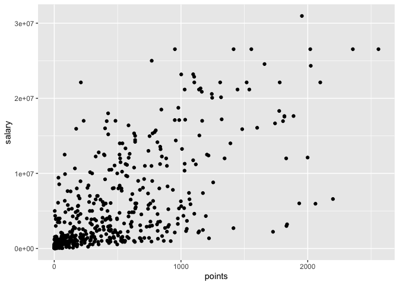
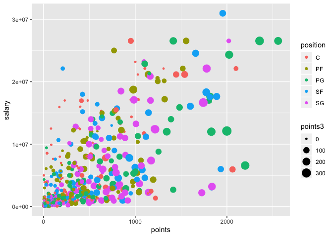

Lab 4: Importing Tables and Intro to ggplot2
================
Gaston Sanchez

> ### Learning Objectives:
>
> -   Practice basic manipulation of data files
> -   Importing Data Tables in R
> -   Default reading-table functions

### General Instructions

-   Write your descriptions, explanations, and code in an `Rmd` (R markdown) file.
-   Name this file as `lab04-first-last.Rmd`, where `first` and `last` are your first and last names (e.g. `lab04-gaston-sanchez.Rmd`).
-   Knit your `Rmd` file as an html document (default option).
-   Submit your `Rmd` and `html` files to bCourses, in the corresponding lab assignment.

------------------------------------------------------------------------

Abalone Data Set
----------------

The first part of the lab involves importing the **Abalone Data Set** that is part of the [UCI Machine Learning Repository](http://archive.ics.uci.edu/ml/datasets/Abalone)

The location of the data file is:

<http://archive.ics.uci.edu/ml/machine-learning-databases/abalone/abalone.data>

The location of the data dictionary (description of the data) is:

<http://archive.ics.uci.edu/ml/machine-learning-databases/abalone/abalone.names>

Look at both the dataset file, and the file with its description, and answer the following questions:

-   What's the character delimiter?
-   Is there a row for column names?
-   Are there any missing values? If so, how are they encoded?
-   What is the data type of each column?

One basic way to read this file in R is by passing the url location of the file directly to any of the `read.table()` functions. Here's an example using `read.table()` in an extremely default way:

``` r
url <- "http://archive.ics.uci.edu/ml/machine-learning-databases/abalone/abalone.data"
abalone <- read.table(url, sep = ",")
```

### Getting a Local Copy of the Data

My suggestion when reading datasets from the Web, is to always try to get a local copy of the data file in your machine (as long as you have enough free space to save it in your computer). To do this, you can use the function `download.file()` and specify the url address, and the name of the file that will be created in your computer. For instance, to save the abalone data file in **your working directory**, type the following commands directly on the R console:

``` r
# do NOT include this code in your Rmd file
# download copy to your working directory
origin <- 'http://archive.ics.uci.edu/ml/machine-learning-databases/abalone/abalone.data'
destination <- 'abalone.data'
download.file(origin, destination)
```

Some Bash Commands
------------------

Before describing some of the reading-table functions in R, let's practice some basic bash commands to inspect the downloaded data file. Include the commands in your Rmd file inside an unevaluated code chunk.

### Your turn

-   Use the `file` command to know what type of file is `abalone.data`.

-   Use the *word count* command `wc` to obtain information about: 1) newline count, 2) word count, and 3) byte count, of the `abalone.data` file.

-   See the `man` documentation of `wc` and learn what option you should use to otabin only the number of lines in `abalone.data`.

-   Use `head` to take a peek at the first lines (10 lines by default) of `abalone.data`

-   See the `man` documentation of `head` and learn what option you should use to display only the first 5 files in `abalone.data`.

-   Use `tail` to take a peek at the last lines (10 lines by default) of `abalone.data`

-   See the `man` documentation of `tail` and learn what option you should use to display only the last 3 files in `abalone.data`.

-   Use the `less` command to look at the contents of `abalone.data` (this command opens a *paginator* so you can move up and down the contents of the file). Press the key `q` to exit the paginator.

------------------------------------------------------------------------

Basic Importing
---------------

Now that you have a local copy of the dataset, you can read it in R with `read.table()` like so:

``` r
# reading data from your working directory
abalone <- read.table("abalone.data", sep = ",")
```

Once you read a data table, you may want to start looking at its contents, usually taking a peek at a few rows. This can be done with `head()` and/or with `tail()`:

``` r
# take a peek of first rows
head(abalone)

# take a peek of last rows
tail(abalone)
```

Likewsie, you may also want to examine how R has decided to take care of the storage details (what data type is used for each column?). Use the function `str()` to check the structure of the data frame:

``` r
# check data frame's structure
str(abalone, vec.len = 1)
```

### Detailed information about the columns

So far we have been able to read the data file in R. But we are missing a few things. First, we don't have names for the columns. Second, it would be nice if we could specify the data types of each column instead of letting R guess how to handle each data type.

Look at the data description (see "Attribute information") in the following link:

<http://archive.ics.uci.edu/ml/machine-learning-databases/abalone/abalone.names>

According to the description of the Abalone data set, we could assign the following data types to each of the columns as:

| Name           | Data Type  |
|----------------|------------|
| Sex            | character  |
| Length         | continuous |
| Diameter       | continuous |
| Height         | continuous |
| Whole weight   | continuous |
| Shucked weight | continuous |
| Viscera weight | continuous |
| Shell weight   | continuous |
| Rings          | integer    |

-   Create a vector `column_names` for names of each column. Use the names displayed in the section "7. Attributes Information".

-   Create another vector `column_types` with R data types (e.g. `character`, `real`, `integer`). Match the R data types with the suggested type in "7. Attributes Information" (nominal = `character`, continuous = `real`, integer = `integer`).

-   Optionally, you could also specify a type "factor" for the variable `sex` since this is supposed to be in nominal scale (i.e. it is a categorical variable). Also note that the variable `rings` is supposed to be integers, therefore we can choose an `integer` vector for this column.

-   Look at the documentation of the function `read.table()` and try to read the `abalone.data` table in R. Find out which arguments you need to specify so that you pass your vectors `column_names` and `column_types` to `read.table()`. Read in the data as `abalone`, and then check its structure with `str()`.

-   Now re-read `abalone.data` with the `read.csv()` function. Name this data as `abalone2`, and check its structure with `str()`.

-   How would you read just the first 10 lines in `abalone.data`? Name this data as `abalone10`, and check its structure with `str()`.

-   How would you skip the first 10 lines in `abalone.data`, in order to read the next 10 lines (lines 11-20)? Name this data as `abalone20`, and check its structure with `str()`.

-   Use R functions to compute descriptive statistics, and confirm the following statistics. Your output does not have to be in the same format of the table below. The important thing is that you begin learning how to manipulate columns (or vectors) of a data.frame.

<!-- -->

           Length Diam  Height  Whole  Shucked  Viscera    Shell    Rings
    Min    0.075  0.055 0.000   0.002    0.001    0.001    0.002        1
    Max    0.815  0.650 1.130   2.826    1.488    0.760    1.005       29
    Mean   0.524  0.408 0.140   0.829    0.359    0.181    0.239    9.934
    SD     0.120  0.099 0.042   0.490    0.222    0.110    0.139    3.224

------------------------------------------------------------------------

Introduction to `"ggplot2"`
---------------------------

The second part of the lab involves a first introduction to the R package `"ggplot2"`. While you follow this lab, you may want to open these cheat sheets:

-   [dplyr cheatsheet](../cheatsheets/data-transformation-cheatsheet.pdf)
-   [ggplot2 cheatsheet](../cheatsheets/ggplot2-cheatsheet-2.1.pdf)

### Filestructure and Shell Commands

We want you to keep practicing with the command line (e.g. Mac Terminal, Gitbash). Follow the steps listed below to create the necessary subdirectories like those depicted in this scheme:

        lab04/
          README.md
          data/
            nba2018-players.csv
          report/
            lab04-first-last.Rmd
          images/
            ... # all the plot files

-   Open a command line interface (e.g. Terminal or GitBash)
-   Change your working directory to a location where you will store all the materials for this lab
-   Use `mkdir` to create a directory `lab04` for the lab materials
-   Use `cd` to change directory to (i.e. move inside) `lab04`
-   Create other subdirectories: `data`, `report`, `images`
-   Use `ls` to list the contents of `lab04` and confirm that you have all the subdirectories.
-   Use `touch` to create an empty `README.md` text file
-   Use a text editor (e.g. the one in RStudio) to open the `README.md` file, and then add a brief description of today's lab, using markdown syntax.
-   Change directory to the `data/` folder.
-   Download the data file with the command `curl`, and the `-O` option (letter O)

    ``` bash
    curl -O https://raw.githubusercontent.com/ucb-stat133/stat133-fall-2019/master/data/nba2018-players.csv
    ```

-   Use `ls` to confirm that the csv file is in `data/`
-   Use *word count* `wc` to count the lines of the csv file
-   Take a peek at the first rows of the csv file with `head`
-   Take a peek at the last 5 rows of the csv file with `tail`

### Installing `"ggplot2"`

I'm assuming that you already installed the package `"ggplot2"`. If that's not the case then run on the console the command below (do NOT include this command in your `Rmd`):

``` r
# don't include this command in your Rmd file
# don't worry too much if you get a warning message
install.packages("ggplot2")
```

Remember that you only need to install a package once. What you should always invoke in order to use the functions in a package is the `library()` function:

``` r
# (include these commands in your Rmd file)
# don't forget to load the packages
library(ggplot2)
```

### Path for Images

The other important specification to include in your Rmd file is a global chunk option to specify the location of plots and graphics. This is done by setting the `fig.path` argument inside the `knitr::opts_chunk$set()` function.


If you don't specify `fig.path`, `"knitr"` will create a default directory to store all the plots produced when knitting an Rmd file. This time, however, we want to have more control over where things are placed. Because you already have a folder `images/` as part of the filestructure, this is where we want `"knitr"` to save all the generated graphics.

Notice the use of a relative path `fig.path = '../images/'`. This is because your Rmd file should be inside the folder `report/`, but the folder `images/` is outside `report/` (i.e. in the same parent directory of `report/`).

------------------------------------------------------------------------

NBA Players Data
----------------

The data file for this lab is the same you used last week: `nba2018-players.csv`.

Use the function `read.csv()` to import the data in R. During the reading process, specify the following data types for the columns in `nba2018-players.csv`:

| Name         | Data Type |
|--------------|-----------|
| "player"     | character |
| "team"       | factor    |
| "position"   | factor    |
| "height"     | integer   |
| "weight"     | integer   |
| "age"        | integer   |
| "experience" | integer   |
| "college"    | character |
| "salary"     | real      |
| "games"      | real      |
| "minutes"    | real      |
| "points"     | real      |
| "points3"    | real      |
| "points2"    | real      |
| "points1"    | real      |

------------------------------------------------------------------------

First contact with `ggplot()`
=============================

The package `"ggplot2"` is probably the most popular package in R to create *beautiful* static graphics. Comapred to the functions in the base package `"graphcics"`, the package `"ggplot2`" follows a somewhat different philosophy, and it tries to be more consistent and modular as possible.

-   The main function in `"ggplot2"` is `ggplot()`
-   The main input to `ggplot()` is a data frame object.
-   You can use the internal function `aes()` to specify what columns of the data frame will be used for the graphical elements of the plot.
-   You must specify what kind of *geometric objects* or **geoms** will be displayed: e.g. `geom_point()`, `geom_bar()`, `geom_boxpot()`.
-   Pretty much anything else that you want to add to your plot is controlled by auxiliary functions, especially those things that have to do with the format, rather than the underlying data.
-   The construction of a ggplot is done by *adding layers* with the `+` operator.

### Scatterplots

Let's start with a scatterplot of `salary` and `points`

``` r
# scatterplot (option 1)
ggplot(data = dat) +
  geom_point(aes(x = points, y = salary))
```



-   `ggplot()` creates an object of class `"ggplot"`
-   the main input for `ggplot()` is `data` which must be a data frame
-   then we use the `"+"` operator to add a layer
-   the geometric object (geom) are points: `geom_points()`
-   `aes()` is used to specify the `x` and `y` coordinates, by taking columns `points` and `salary` from the data frame

The same scatterplot can also be created with this alternative, and more common use of `ggplot()`

``` r
# scatterplot (option 2)
ggplot(data = dat, aes(x = points, y = salary)) +
  geom_point()
```

### Label your chunks!

When including code for plots and graphics, we strongly recommend that you create an individual code chunk for each plot, and that you **give a label** to that chunk. This is illustrated in the following screenshot.


Note that the code chunk has a label `scatterplot1`; moreover, the code is exclusively decidated to this plot. Why should you care? Because when `"knitr"` creates the file of the plot, it will use the chunk label for the graph. So it's better to give meaningful names to those chunks containing graphics.

### Adding color

Say you want to color code the points in terms of `position`

``` r
# colored scatterplot 
ggplot(data = dat, aes(x = points, y = salary)) +
  geom_point(aes(color = position))
```


Maybe you wan to modify the size of the dots in terms of `points3`:

``` r
# sized and colored scatterplot 
ggplot(data = dat, aes(x = points, y = salary)) +
  geom_point(aes(color = position, size = points3))
```



To add some transparency effect to the dots, you can use the `alpha` parameter.

``` r
# sized and colored scatterplot 
ggplot(data = dat, aes(x = points, y = salary)) +
  geom_point(aes(color = position, size = points3), alpha = 0.7)
```


Notice that `alpha` was specified outside `aes()`. This is because we are not using any column for the `alpha` transparency values.

### Your turn:

-   Open the [ggplot2 cheatsheet](../cheatsheets/ggplot2-cheatsheet-2.1.pdf)

-   Make a scatterplot of `height` and `weight`, for ALL the warriors players.

-   Find out how to make another scatterplot like the previous one, but now using `geom_text()` to display the names of the players.

-   Make another scatterplot similar to the previous one, but now displaying the names of the players with `geom_label()`. What is the difference between `geom_text()` and `geom_label()`?

-   Get a density plot of `salary` (for all NBA players).

-   Get a histogram of `points2` with binwidth of 50 (for all NBA players).

-   Get a barchart of the `position` frequencies (for all NBA players).

-   Make a scatterplot of `experience` and `salary` of all Centers, and use `geom_smooth()` to add a regression line.

-   Repeat the same scatterplot of `experience` and `salary` of all Centers, but now use `geom_smooth()` to add a loess line (i.e. smooth line).

------------------------------------------------------------------------

Faceting
--------

One of the most attractive features of `"ggplot2"` is the ability to display multiple **facets**. The idea of facets is to divide a plot into subplots based on the values of one or more categorical (or discrete) variables.

Here's an example. What if you want to get scatterplots of `points` and `salary` separated (or grouped) by `position`? This is where faceting comes handy, and you can use `facet_warp()` for this purpose:

``` r
# scatterplot by position
ggplot(data = dat, aes(x = points, y = salary)) +
  geom_point() +
  facet_wrap(~ position)
```


The other faceting function is `facet_grid()`, which allows you to control the layout of the facets (by rows, by columns, etc)

``` r
# scatterplot by position
ggplot(data = dat, aes(x = points, y = salary)) +
  geom_point(aes(color = position), alpha = 0.7) +
  facet_grid(~ position) +
  geom_smooth(method = loess)
```


``` r
# scatterplot by position
ggplot(data = dat, aes(x = points, y = salary)) +
  geom_point(aes(color = position), alpha = 0.7) +
  facet_grid(position ~ .) +
  geom_smooth(method = loess)
```


### Your turn:

-   Make scatterplots of `experience` and `salary` faceting by `position`

-   Make scatterplots of `experience` and `salary` faceting by `team`

-   Make density plots of `age` faceting by `team`

-   Make scatterplots of `height` and `weight` faceting by `position`

-   Make scatterplots of `height` and `weight`, with a 2-dimensional density, `geom_density2d()`, faceting by `position`

-   Make a scatterplot of `experience` and `salary` for the Warriors, but this time add a layer with `theme_bw()` to get a simpler background

-   Repeat any of the previous plots but now adding a leyer with another theme e.g. `theme_minimal()`, `theme_dark()`, `theme_classic()`

------------------------------------------------------------------------

More shell commands
-------------------

Now that you have a bunch of images inside the `images/` subdirectory, let's keep practicing some basic commands.

-   Open the terminal.

-   Move inside the `images/` directory of the lab.

-   List the contents of this directory.

-   Now list the contents of the directory in *long format*.

-   How would you list the contents in long format, by time?

-   How would you list the contents displaying the results in reverse (alphabetical)? order

-   Without changing your current directory, create a directory `copies` at the parent level (i.e. `lab04/`).

-   Copy one of the PNG files to the `copies` folder.

-   Use the wildcard `*` to copy all the `.png` files in the directory `copies`.

-   Change to the directory `copies`.

-   Use the command `mv` to rename some of your PNG files.

-   Change to the `report/` directory.

-   From within `report/`, find out how to rename the directory `copies` as `copy-files`.

-   From within `report/`, delete one or two PNG files in `copy-files`.

-   From within `report/`, find out how to delete the directory `copy-files`.
