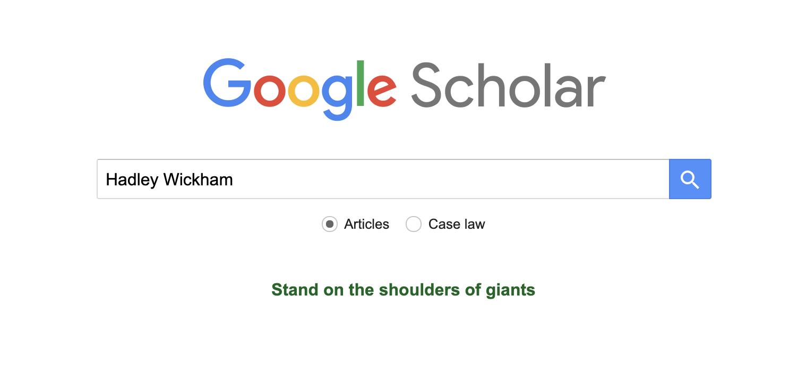
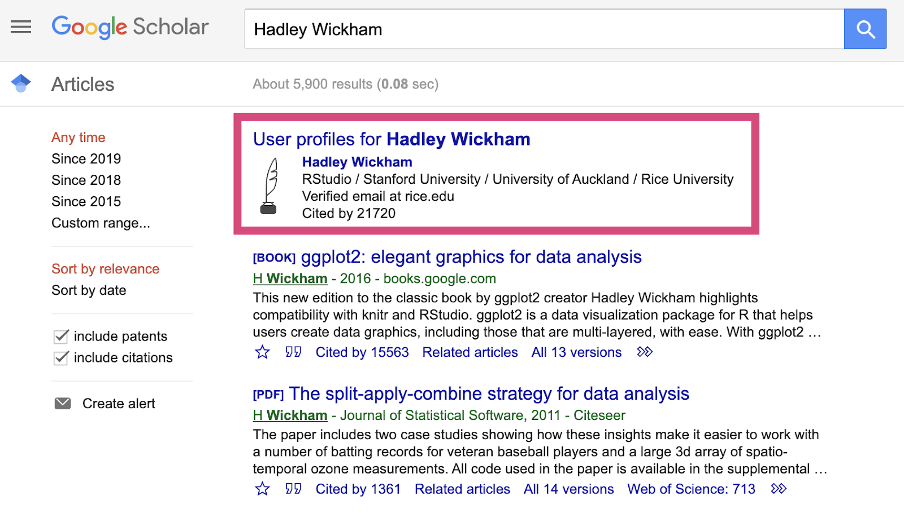
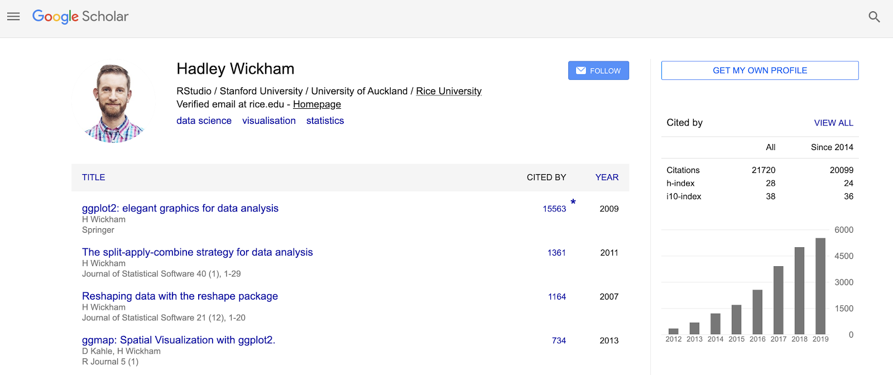
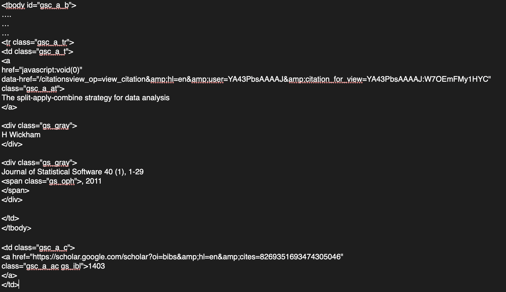
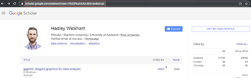
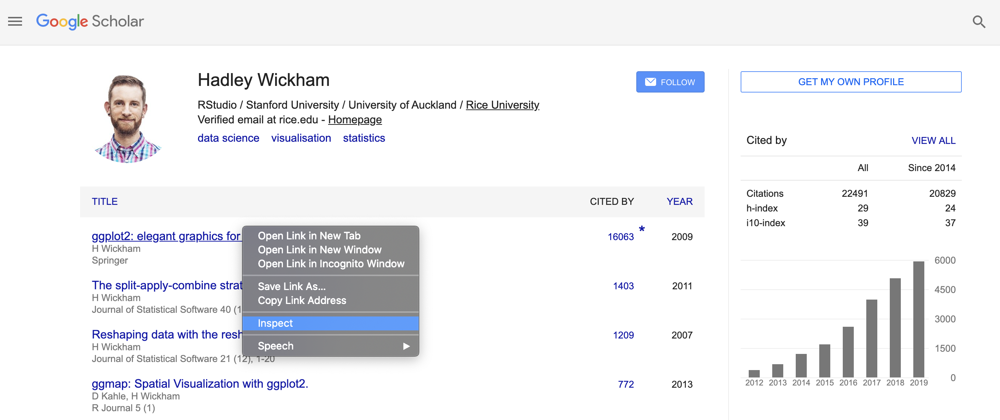
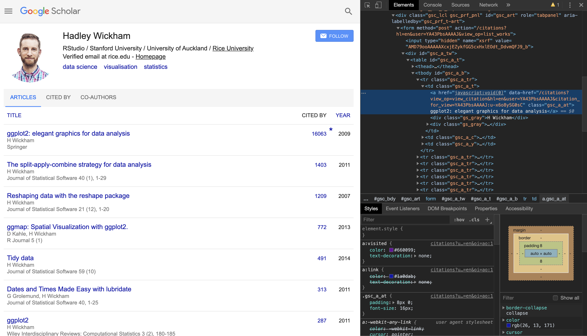
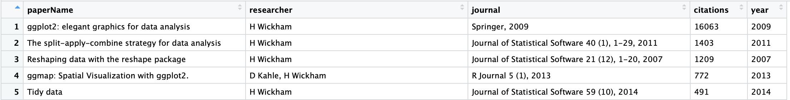

Lab 11: Web Scraping
================
Cindy Zhang, Sargam Jain, Colin Kou, Gaston Sanchez
11/12/2019

> ### Learning Objectives:
> 
>   - Work with the package `rvest` and `xml2`
>   - Learn to extract html elements and attributes
>   - Web scrapping

> ### General Instructions
> 
>   - Write your descriptions and code, in an Rmd (R markdown) file.
>   - Name this file as lab11-first-last.Rmd, where first and last are
>     your first and last names (e.g. lab11-gaston-sanchez.Rmd).
>   - Knit your Rmd file as an html document (default option).
>   - Submit both your Rmd and html files to bCourses under Lab11
>     assignment.
>   - Due date displayed in bCourse.

# Required Packages

In this lab, we will be using the following R packages to manipulate
HTML source code. Please install them using `install.packages( )` if you
don’t have them on your computer already. Remember to remove or comment
the command for installing packages before you knit the Rmd file,
otherwise you will end up downloading the package repeatedly.

``` r
library(xml2)
library(rvest)
```

    ## Warning: package 'rvest' was built under R version 3.5.2

# Extract information from Google Scholar

The goal of this lab is to extract citations for an author from **Google
Scholar**. More specifically, we will extract the citations’ data for
**Hadley Wickam**, the winner of the COPSS Presidents’ Award (the “Nobel
Prize” of Statistics), one of the most prestigious awards in Statistics.

### Find Hadley Wickam’s Profile page

Go to <https://scholar.google.com/> and enter the name of the author,
**Hadley Wickam** as shown in the image below:



If you enter the google search, you should see that the first item
returned is a **User profile** as shown in the image below:



Next, click on the hyperlink for the author’s name under **User
profiles**. You will see that it brings you to a page that shows the
citations for the author’s 20 most cited papers (refer to the image
below):



**In this lab, we will write R code to scrape the citations data for
Hadley Wickham.**

<font color='red'> **Note:** if you repeatedly query the Google Scholar
site too frequently, Google will start returning “503” errors because it
detects automated usage. To avoid troubling Google servers, please add
the following R code in your web scraping. So, if you are going to run
your code from an R code chunk cell in your markdown file, please add
the following command before the web scraping command to download the
HTML: </font>

``` r
Sys.sleep(15)
# followed by your code
```

### HTML source code

Now, let’s look at what is behind all the webpages. We can explore the
underlying HTML source code in advance, before we start writing R code.
For this you can explore the **Page source** in three alternate ways:

  - directly in the browser, for example,
      - in Firefox: Web Developer –\> Page Source
      - in Chrome View –\> Developer tools
      - right click in brower –\> Page Source, or
  - by downloading the webpage and opening it in Rstudio


In the HTML file, we can see the complicated yet organized HTML source
code. It’s using some paired **\<\>** to indicate the starting and
ending point of individual hierarchical-structure elements.

For example, here is the HTML source behind one line of the publications
in the page:

**Hadley Wickham - Google Scholar Citations**



This is a markup language, called XML (extensible markup language), used
to store data in self-describing (no metadata needed) format, often with
a hierarchical structure. It consists of sets of elements (also known as
nodes because they generally occur in a hierarchical structure and
therefore have parents, children, etc.) with tags that identify/name the
elements. We can use the XPath language for navigating the hierarchical
tree and, finding and extracting information from the node(s) of
interest.

### Download and read the web page with read\_html()

First, let’s use the function `read_html( )` to read the HTML source
code from the author’s page. The `read_html( )` function requires the
URL of the webpage to be scraped. So copy the URL of the page from the
web browser:



Here is how we can download the read in the web page:

``` r
# Assemble url (so it fits on screen)
scholar <- "https://scholar.google.com/citations?user="
author <- "YA43PbsAAAAJ&hl=en&oi=ao" 
author_url <- paste0(scholar, author) # full url of the page

# Download HTML file to your working directory
download.file(author_url,  'google_scholar.html')

# Read the HTML file
parent_data <- read_html('google_scholar.html')
```

<font color='red'> **Note: ** Use the downloaded HTML to develop the
remainder of your code and don’t keep re-downloading the HTML as you
work on the remainder of the code. </font>

`read_html( )` works by reading in the HTML as text and then parsing it
to build up a tree con- taining the HTML elements. Then we can use
`html_nodes( )` to find the nodes and if there are tables, we can use
`html_table( )` to convert them to data frames, which is shown below:

``` r
### Syntax
table_data <- html_table(parent_data) 
```

### **Your turn**:

Explore the elements of the extracted table and answer the following
questions.

  - Extract the Google scholar ID of the author from the URL. It
    contains 12 characters.
  - Extract and store the summary table of the citations in the top
    right corner of the user profile page
  - Extract and store all the titles/name/journal of the papers in a
    vector `long_info`
  - Extract and store number of the citations in a vector `citation`
  - Extract and store the years of publication in a vector `year`

### Alternative way of reading the nodes: `html_nodes()`

You may already have noticed that some of the information on the page is
not well organized in the earlier table, such as co-authors and name of
the journals. Let’s now look into the HTML source closely to get these
elements. For any object/string on the webpage, you can do a right click
and choose ‘inspect’ to see its HTML source code. Refer to the picture
below.





Now, we will make use of `html_nodes()`. The following command returns
the HTML code script for the entire table body. Explore the HTML
elements extracted using following commands:

``` r
table_body <- parent_page %>% html_nodes(xpath = '//*[@id="gsc_a_b"]')
```

The following command returns the HTML code script for only one row of
the body.

``` r
table_row <- parent_page %>% html_nodes(xpath = '//*[@id="gsc_a_tr"]')
```

### **Your turn**:

  - Extract information from the web page using html\_nodes() and store
    the information in a dataframe like this:



  - Among the 20 articles, give the title of the most cited article?
  - Among the 20 articles, in which years has the author published more
    than two articles?
